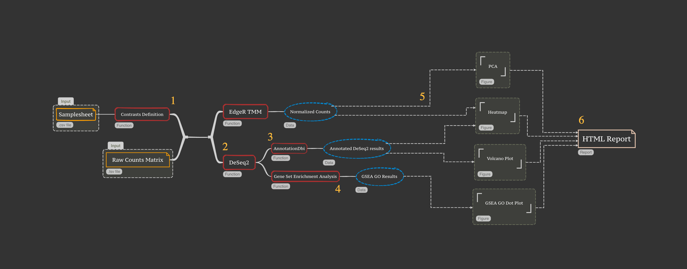
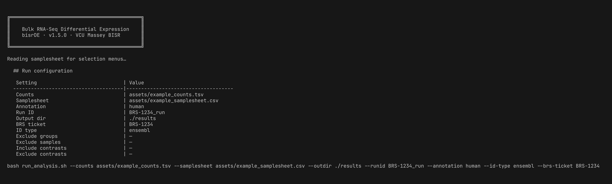

# Differential Expression Analysis Pipeline

**v1.6.4** — VCU Massey Comprehensive Cancer Center Bioinformatics Shared Resource (BISR)

## Introduction

This is a reproducible bioinformatics pipeline that performs differential gene expression analysis on bulk RNA-seq count data. It consumes a merged-counts TSV (typically from [`nf-core/rnaseq`](https://nf-co.re/rnaseq)) and a samplesheet describing contrasts, and produces a self-contained HTML report that includes:

- **Per-comparison DE**: DESeq2 with annotation (Ensembl ID, Entrez ID, gene Symbol, gene name) and four enrichment analyses (GO, KEGG, Reactome, MSigDB Hallmark).
- **Sample exploration**: 2D + 3D PCA (interactive plotly + static), Spearman correlation heatmap, vst-transformed Euclidean distance heatmap, library-size + detected-gene barplots, hierarchical clustering dendrogram + log-CPM density.
- **Manuscript-ready Methods text**, dynamically populated with tool versions and species-correct genome assembly.

Three entry points exist:

1. **Interactive launcher** (recommended) — `bash run_interactive.sh`, a guided, styled launcher that lets you pick a **bash session or a Go TUI**, walks you through every option (including sample / group / contrast selection), then hands off to `run_analysis.sh`.
2. **Standalone** — `bash run_analysis.sh ...` for scripts / CI (this README).
3. **Nextflow DSL2** — `nextflow run nf-module/main.nf ...` (see [`nf-module/README.md`](nf-module/README.md)) for **downstream chaining after `nf-core/rnaseq`**.

## Table of Contents

- [Repo layout](#repo-layout)
- [Pipeline](#pipeline)
- [Environment setup](#environment-setup)
- [Usage](#usage)
  - [Preparing your data](#preparing-your-data)
  - [Running the pipeline](#running-the-pipeline)
  - [CLI arguments](#cli-arguments)
- [Pipeline output](#pipeline-output)
- [Nextflow integration](#nextflow-integration)
- [Limitations](#limitations)
- [Utilizing IPA](#utilizing-ipa)
- [Contact](#contact)
- [License](#license)

## Repo layout

```
differential_expression/
├── README.md                 # this file
├── CHANGELOG.md              # at repo root: differential_expression/../CHANGELOG.md
├── de.R                      # thin optparse wrapper -> bisrDE::run_pipeline + generate_report
├── run_interactive.sh        # guided launcher (recommended): bash session OR Go TUI chooser
├── run_analysis.sh           # non-interactive executor (auto-detects mac/linux + container)
├── build_container.sh        # builds dge_analysis.sif from dge_analysis.def
├── dge_analysis.def          # Apptainer recipe: R 4.2 + renv lib + bisrDE + Quarto CLI
├── setup_renv.R              # one-time renv bootstrap helper
├── renv.lock                 # pinned R deps
├── assets/
│   ├── example_counts.tsv    # 10-gene mouse fixture (smoke test)
│   └── example_samplesheet.csv
├── bisrDE/                   # bisrDE R package (DESeq2 DE, QC, 4-backend GSEA, Quarto report)
│   ├── DESCRIPTION
│   ├── R/                    # io, normalize, de, annotate, enrich, plots_*, pipeline, cli, utils, report
│   ├── inst/qmd/             # Quarto report template + per-comparison child
│   └── tests/testthat/       # unit + behavior tests
├── tui/                      # Go TUI launcher (bubbletea/huh/lipgloss) -> bisrde-tui
│   └── README.md             # build + usage; binary is git-ignored
└── nf-module/                # Nextflow DSL2 wrapper (downstream of nf-core/rnaseq)
    ├── main.nf
    ├── modules/local/bisr_de.nf
    ├── nextflow.config
    └── tests/main.nf.test    # nf-test fixture
```

## Pipeline



1. **Parse contrasts** from the samplesheet (one column per `experiment_vs_control`; `1` = exp, `0` = ctrl, blank = exclude).
2. **Align + filter** the counts matrix to the samplesheet's `SampleID` order; pre-filter genes with fewer than 3 samples having ≥10 reads.
3. **Normalize** via edgeR TMM (heatmap + sample-exploration substrate) and DESeq2 (DE testing substrate).
4. **DESeq2** per contrast — Wald test + Benjamini-Hochberg FDR correction.
5. **Annotate** results with Ensembl ID, Entrez ID, gene Symbol, gene name (from `org.Hs.eg.db` / `org.Mm.eg.db`).
6. **Enrichment** (independent of significance threshold; ranked-list GSEA on log2FC):
   - GO Biological Process / Molecular Function / Cellular Component (`clusterProfiler::gseGO`).
   - KEGG pathways (`clusterProfiler::gseKEGG`).
   - Reactome pathways (`ReactomePA::gsePathway`).
   - MSigDB Hallmark gene sets (`clusterProfiler::GSEA` + `msigdbr` H collection).
7. **Plots** per comparison: volcano, all-significant heatmap, top-100-by-padj heatmap (with gene Symbol labels), GSEA dotplots (split by Activated / Suppressed for each backend).
8. **Sample exploration** (across all samples): 2D + 3D PCA (interactive plotly), Spearman correlation heatmap, vst Euclidean distance heatmap, library-size + detected-gene barplots, hierarchical clustering (Ward.D2) + per-sample log-CPM density.
9. **Quarto report** — single self-contained HTML with all of the above, plus interpretation callouts, a comparisons summary table, manuscript-ready Methods + References, and an IPA upload guide.

**Significance thresholds** (configurable in code; reported in the manuscript text): `padj ≤ 0.05` AND `|log2FC| ≥ 0.58` (≈1.5× fold change).

## Environment setup

The pipeline uses [`renv`](https://rstudio.github.io/renv/) for R reproducibility plus [Quarto](https://quarto.org) for report rendering. The launcher (`run_analysis.sh`) auto-detects platform and chooses execution method.

### Required tooling

| Tool      | Min version | Notes                                                                   |
|-----------|-------------|-------------------------------------------------------------------------|
| R         | 4.2         | `renv::restore()` will pull pinned package versions on first run.       |
| Quarto    | 1.5+        | Required for report rendering. Install via `brew install --cask quarto` (macOS) or [download](https://quarto.org/docs/get-started/). |
| Apptainer | 1.0+        | _Optional._ Only for container execution (recommended on HPC).          |
| Nextflow  | 22.10+      | _Optional._ Only for the Nextflow DSL2 wrapper (see [`nf-module/`](nf-module/README.md)). |

### Local macOS

First-run `renv::restore()` takes ~30-60 minutes. Afterwards, the launcher is fast:

```bash
bash run_analysis.sh \
    --counts <counts.tsv> --samplesheet <samplesheet.csv> \
    --outdir results --runid my_run --annotation mouse
```

### Linux / HPC (conda, recommended)

Getting the pipeline onto the cluster, start to finish:

```bash
# 1. Code
git clone https://github.com/VCU-Bioinformatics-Core/bulk_rnaseq_analyses.git
cd bulk_rnaseq_analyses/differential_expression

# 2. Environment. If your site has no conda, bootstrap micromamba into $HOME
#    (single static binary, no admin rights, ~10 MB):
#      curl -Ls https://micro.mamba.pm/api/micromamba/linux-64/latest | tar -xvj bin/micromamba
#      export PATH="$PWD/bin:$PATH"
micromamba create -n bisrde -f environment.yml \
    --override-channels -c conda-forge -c bioconda -y
micromamba activate bisrde          # or: conda activate bisrde

# 3. ONE-TIME: stop renv from hijacking this environment.
#    The repo ships a .Rprofile that auto-activates renv, which points R at an
#    empty project library and hides everything conda installed (the symptom is
#    "there is no package called 'remotes'"). Baking the setting into the env
#    means every future activation is safe — including plain `Rscript` calls.
mkdir -p "$CONDA_PREFIX/etc/conda/activate.d"
echo 'export RENV_CONFIG_AUTOLOADER_ENABLED=FALSE' \
    > "$CONDA_PREFIX/etc/conda/activate.d/renv_off.sh"
micromamba deactivate && micromamba activate bisrde

Rscript -e '.libPaths()'   # sanity: must be inside $CONDA_PREFIX, not renv/library

# 4. The pipeline package itself
Rscript -e 'remotes::install_local("bisrDE", upgrade = "never")'

# 5. Smoke-test on the bundled 10-gene fixture (~2 min)
bash run_analysis.sh --counts assets/example_counts.tsv \
    --samplesheet assets/example_samplesheet.csv \
    --outdir /tmp/bisrde_smoke --runid smoke --annotation mouse
```

If step 5 produces `rnaseq_analysis_*.html`, the install is good.

> **If you skipped step 3**, any direct `Rscript` call fails with
> `there is no package called 'remotes'` (or any other conda-installed
> package). That is renv's autoloader pointing R at an empty project library.
> One-off escape hatch:
>
> ```bash
> RENV_CONFIG_AUTOLOADER_ENABLED=FALSE Rscript -e '...'
> ```
>
> `run_analysis.sh` sets this itself when it sees an activated conda env, so
> pipeline *runs* are safe either way — it is direct `Rscript` invocations
> (installing the package, `de.R`, `compare_runs.R`) that need step 3.

**Note:** `environment.yml` pins **Bioconductor 3.18 / R 4.3**, not the
`renv.lock` 3.16 — Bioc 3.16 is not installable from bioconda (see the header
of `environment.yml` for the two blocking dependency conflicts). Results are
therefore *near*-equivalent, not identical. Validate before production use:

```bash
Rscript compare_runs.R --a <renv_reference_run> --b <conda_run> --out validation.md
```

Exit status is 0 PASS / 1 WARN / 2 FAIL, so it can gate a deployment.

#### Batch submission

`submit_slurm.sh` is a ready sbatch template (4 cpus / 32 G / 4 h by default):

```bash
sbatch --export=ALL,COUNTS=/path/counts.tsv,SAMPLESHEET=/path/ss.csv,\
OUTDIR=$PWD/results,RUNID=my_run,ANNOTATION=human submit_slurm.sh

squeue -u "$USER"
tail -f slurm-bisrde-<jobid>.out
```

Raise `--mem` before `--cpus-per-task` if a job is killed; DESeq2 and the four
GSEA backends are memory-bound rather than CPU-bound.

### Linux / HPC (renv)

Identical command; the launcher falls back to local R + renv when no container is found.

```bash
module load R/4.2.1   # or your HPC's R module
bash run_analysis.sh ...
```

### Linux / HPC (container, recommended)

Build once, then run:

```bash
# 1. Build the container (one time, ~30 min)
bash build_container.sh

# 2. Run — launcher auto-detects the .sif and uses Apptainer
bash run_analysis.sh ...
```

The container (`dge_analysis.sif`) bundles R 4.2 + the pinned renv lib, the `bisrDE` R package (via `remotes::install_local`), and the **Quarto CLI** (pinned 1.5.57) — so report rendering works out of the box. The `.sif` is built on an x86_64 Linux host (`bash build_container.sh`); the def file is build-ready.

## Usage

### Preparing your data

Two input files are required: the **merged counts matrix** and the **samplesheet**.

#### 1. Merged counts (TSV)

The **first column is the gene identifier** (`gene_id`, `Geneid`, …); the remaining columns are **per-sample counts** whose headers must match the samplesheet's `SampleID` values. Known metadata columns are recognised **by name and dropped automatically**, so the common `nf-core/rnaseq` count-file organizations work as-is (no reformatting needed):

| Quantifier | File | Layout |
|------------|------|--------|
| salmon | `salmon.merged.gene_counts.tsv` | `gene_id, gene_name, <samples…>` |
| RSEM | `rsem.merged.gene_counts.tsv` | `gene_id, transcript_id(s), <samples…>` |
| featureCounts-style | — | `Geneid, Chr, Start, End, Strand, Length, <samples…>` |

The dropped names include `gene_name`, `transcript_id(s)`, `Chr`, `Start`, `End`, `Strand`, `Length`, `biotype`, and `description` — so the numeric `Start`/`End`/`Length` annotation columns are **not** mistaken for samples. Ensembl gene-ID version suffixes (`ENSG…​.4`) are stripped and `_PAR_Y` pseudo-autosomal duplicates dropped, while gene **symbols** that contain dots (e.g. `H2-M10.1`) are left intact.

| gene_id            | sample1_r1 | sample1_r2 | sample1_r3 | sample2_r1 | sample2_r2 | sample2_r3 |
|--------------------|------------|------------|------------|------------|------------|------------|
| ENSMUSG00000000001 | 1234       | 2345       | 3456       | 4567       | 5678       | 6789       |
| ENSMUSG00000000002 | 1234       | 2345       | 3456       | 4567       | 5678       | 6789       |

Ensembl version suffixes (e.g. `ENSG00000123.4`) are stripped automatically.

#### 2. Samplesheet (CSV)

Must contain at least these columns: `SampleID`, `GroupID`, then one column per contrast. Each contrast column encodes `1` = experimental, `0` = control, blank = excluded.

| SampleID   | GroupID     | exp1_vs_ctrl1 | exp2_vs_ctrl2 |
|------------|-------------|---------------|---------------|
| sample1_r1 | experiment1 | 1             |               |
| sample1_r2 | experiment1 | 1             |               |
| sample2_r1 | control1    | 0             |               |
| sample3_r1 | experiment2 |               | 1             |
| sample4_r1 | control2    |               | 0             |

**Optional columns** (v1.5.0+) — placed anywhere between `GroupID` and the contrast columns; they are recognised by name and never treated as contrasts:

- `DisplayName` — a human-readable label shown on every sample-labelled figure (heatmaps, barplots, dendrogram, PCA) instead of the `SampleID`. The `SampleID` stays the count-matrix join key; only the labels change. Blank cells fall back to the `SampleID`.
- `Exclude` — set to `1` / `TRUE` / `yes` to drop that sample from the entire analysis. Use this for a permanent "this sample was contaminated" record.

| SampleID   | GroupID  | DisplayName | Exclude | hpvPos_vs_hpvNeg |
|------------|----------|-------------|---------|------------------|
| SRR2219887 | hpvPos   | HPV+ #1     |         | 1                |
| SRR2219889 | hpvPos   | HPV+ #2     |         | 1                |
| SRR2219873 | hpvNeg   | HPV− #1     |         | 0                |
| SRR2219895 | hpvNeg   | HPV− #2     | 1       | 0                |   ← dropped |

### Running the pipeline

Two entry points:

- **`run_interactive.sh`** (v1.5.0+, recommended) — a guided, styled launcher that walks you through every option, including interactive sample / group / contrast selection, then hands off to `run_analysis.sh`.
- **`run_analysis.sh`** — the non-interactive executor (use this in scripts / CI / Nextflow). Never call `Rscript de.R` directly; the launcher handles environment detection.

#### Interactive launcher (recommended)

```bash
bash run_interactive.sh
```



The launcher first asks you to **choose a front-end**:

- **Bash interactive session** — styled shell prompts (uses [charmbracelet `gum`](https://github.com/charmbracelet/gum) / `glow` when installed, plain `read` prompts otherwise).
- **Go TUI** (`tui/bisrde-tui`, v1.6.4) — a [bubbletea](https://github.com/charmbracelet/bubbletea) / [huh](https://github.com/charmbracelet/huh) / [lipgloss](https://github.com/charmbracelet/lipgloss) form. If the binary isn't built yet it offers to build it for you (needs Go 1.23+); see [`tui/README.md`](tui/README.md) for build / cross-compile details. You can also run it directly: `./tui/bisrde-tui`.

Either way you're walked through the counts file, samplesheet, annotation, run ID, output dir, and optional BRS ticket / ID type, then — by reading the samplesheet — offered **multi-select menus to exclude groups / samples and choose which contrasts to run** (wiring directly into the selection features below). A summary is shown for confirmation, and both front-ends assemble the **exact same `run_analysis.sh` command** (a maintained parity contract).

For the polished bash experience (borders, colors, fuzzy multi-select, markdown summary) install the optional [charmbracelet](https://github.com/charmbracelet) tools:

```bash
brew install gum glow freeze    # macOS; see charmbracelet repos for Linux
```

Without them the bash launcher falls back to plain prompts — it always works. The launcher is also scriptable / non-interactive: set `BISR_*` environment variables (e.g. `BISR_COUNTS`, `BISR_SAMPLESHEET`, `BISR_ANNOTATION`, `BISR_RUNID`, `BISR_EXCLUDE_GROUPS`, `BISR_FRONTEND`, …) and pass `--print-cmd` to print the assembled `run_analysis.sh` command without executing it.

#### Mouse analysis

```bash
bash run_analysis.sh \
    --counts mouse_counts.tsv \
    --samplesheet samplesheet.csv \
    --outdir mouse_results \
    --runid mouse_experiment \
    --annotation mouse
```

#### Human analysis with BRS ticket and Entrez IDs

```bash
bash run_analysis.sh \
    --counts human_counts.tsv \
    --samplesheet samplesheet.csv \
    --outdir human_results \
    --runid BRS-1234_run \
    --annotation human \
    --brs-ticket BRS-1234 \
    --id-type entrez
```

#### Smoke test against the bundled fixture

```bash
bash run_analysis.sh \
    --counts assets/example_counts.tsv \
    --samplesheet assets/example_samplesheet.csv \
    --outdir /tmp/bisrDE_smoke \
    --runid smoke_$(date +%s) \
    --annotation mouse \
    --brs-ticket BRS-TEST-0000
```

This runs in ~1-2 minutes on a modern Mac / HPC node and produces `/tmp/bisrDE_smoke/rnaseq_analysis_<timestamp>.html`. Use this to verify the install end-to-end before pointing the pipeline at real data.

### CLI arguments

| Flag                | Short | Required | Default        | Description                                                                 |
|---------------------|-------|----------|----------------|-----------------------------------------------------------------------------|
| `--counts`          | `-c`  | yes      | —              | Merged counts TSV.                                                          |
| `--samplesheet`     | `-s`  | yes      | —              | Samplesheet CSV with `SampleID`, `GroupID`, contrast columns.               |
| `--outdir`          | `-o`  | no       | `./output`     | Output directory (created if missing).                                      |
| `--runid`           | `-r`  | yes      | —              | Unique identifier for this run; appears in the report.                      |
| `--annotation`      | `-a`  | no       | `mouse`        | `mouse` or `human`. Selects OrgDb + KEGG / Reactome / MSigDB organism.      |
| `--brs-ticket`      | `-b`  | no       | (none)         | BRS ticket identifier (e.g. `BRS-1234`). Renders as a subtitle in the report. |
| `--id-type`         | `-i`  | no       | `ensembl`      | `ensembl`, `entrez`, or `symbol`. Identifier type in the count matrix rownames. Output CSVs always carry all four ID columns regardless. |
| `--exclude-samples` |       | no       | (none)         | Comma-separated `SampleID`s to drop from the whole analysis (e.g. `SRR1,SRR2`). Unions with the `Exclude` column. |
| `--exclude-groups`  |       | no       | (none)         | Comma-separated `GroupID`s to drop from the whole analysis. |
| `--include-contrasts` |     | no       | (none)         | Comma-separated contrast columns to process **exclusively** (allowlist). |
| `--exclude-contrasts` |     | no       | (none)         | Comma-separated contrast columns to **skip** (denylist). |

**Examples.** Re-run dropping a QC outlier without editing the samplesheet:

```bash
bash run_analysis.sh --counts c.tsv --samplesheet ss.csv --outdir out --runid rerun \
    --annotation human --exclude-samples SRR2219895
```

Run only one contrast from a 12-contrast samplesheet:

```bash
bash run_analysis.sh --counts c.tsv --samplesheet ss.csv --outdir out --runid focused \
    --annotation human --include-contrasts hpvPos_vs_hpvNeg
```

## Pipeline output

```
<outdir>/
├── rnaseq_analysis_<timestamp>.html   # main deliverable: self-contained Quarto report
├── analysis_results_<timestamp>.rds   # re-renderable analysis bundle (re-run generate_report on it)
├── data/
│   ├── de_data/
│   │   ├── DESeq2_<comparison>.csv
│   │   └── normalizedCounts_tmm<date>.csv
│   ├── gsea_data/                     # GO results
│   ├── kegg_data/                     # KEGG pathway results
│   ├── reactome_data/                 # Reactome pathway results
│   └── hallmark_data/                 # MSigDB Hallmark results
├── figures/
│   ├── volcano/<comparison>_volcano.png
│   ├── heatmap/
│   │   ├── <comparison>_heatmap_all_sig.png      # all DEGs
│   │   └── <comparison>_heatmap_top100.png       # top 100 by padj, gene-symbol labels
│   ├── gsea/<comparison>_GSEA.png                # GO dotplot
│   ├── kegg/<comparison>_KEGG.png
│   ├── reactome/<comparison>_Reactome.png
│   ├── hallmark/<comparison>_Hallmark.png
│   ├── pca/
│   │   ├── PCA_plot.png
│   │   ├── allsamples_PCA_plot.html              # interactive 2D plotly
│   │   └── allsamples_PCA_plot3D.html            # interactive 3D plotly
│   └── qc/
│       ├── qc_correlation_heatmap.png            # Spearman, DE genes
│       ├── qc_vst_dist_heatmap.png               # vst Euclidean distance
│       ├── qc_libsize_detected.png               # library size + detected genes
│       └── qc_hclust_density.png                 # Ward dendrogram + log-CPM density
└── logs/
    └── <timestamp>_session.log                   # tee'd cli output
```

The report HTML is the primary deliverable — it embeds every plot, every results table (with sortable / searchable DT widgets), and the manuscript-ready Methods + References. The CSVs and PNGs are produced for downstream use (IPA upload, manuscript figures, archival).

### Significant DE table columns

| Column           | Meaning                                                                                  |
|------------------|------------------------------------------------------------------------------------------|
| `ENSEMBL_ID`     | Ensembl gene ID (always present, regardless of input `--id-type`).                       |
| `ENTREZID`       | NCBI Entrez gene ID.                                                                     |
| `SYMBOL`         | Gene symbol (e.g. `TP53`).                                                                |
| `GENENAME`       | Full gene name.                                                                           |
| `baseMean`       | Average normalized expression across all samples.                                         |
| `log2FoldChange` | Log2 ratio of expression (exp / ctrl). Positive = up in the experimental group.           |
| `lfcSE`          | Standard error of the log2FC estimate.                                                    |
| `stat`           | Wald test statistic.                                                                      |
| `pvalue`         | Raw Wald p-value.                                                                         |
| `padj`           | Benjamini-Hochberg adjusted p-value (FDR).                                                |

## Nextflow integration

For pipelines that already chain `nf-core/rnaseq`, the `nf-module/` directory provides a DSL2 wrapper. See [`nf-module/README.md`](nf-module/README.md) for a full integration example and `nf-test` setup. Quickstart:

```bash
nextflow run nf-module/main.nf \
    --counts assets/example_counts.tsv \
    --samplesheet assets/example_samplesheet.csv \
    --runid demo \
    --annotation mouse \
    --outdir results/
```

## Limitations

- **Pairwise comparisons only**. Multi-factor designs and covariates are out of scope for now (tracked for a future release).
- **Two species supported**: human (GRCh38) and mouse (GRCm39). Other species require an OrgDb + KEGG-organism-code config that we have not generalized yet.
- **No batch correction** (sva / ComBat) — explicit out-of-scope decision.
- **Container image is x86_64 only** — Apple silicon Macs run the local-R path (which is fully supported).

## Utilizing IPA

The per-comparison `data/de_data/DESeq2_<comparison>.csv` files are pre-formatted for direct upload to **QIAGEN Ingenuity Pathway Analysis (IPA)**. Massey BISR has a VCU site license; if you don't have an account, email **morecockcm@vcu.edu** with your name and VCU email. Login: <https://analysis.ingenuity.com/pa>. Step-by-step instructions are in the [QIAGEN knowledge base](https://qiagen.my.salesforce-sites.com/KnowledgeBase/KnowledgeNavigatorPage?id=kA41i000000L6rMCAS). BISR runs an annual hands-on IPA training in early fall — email us to be added to the list.

The full **manuscript-ready Methods + References + Required Acknowledgements** appear at the bottom of every report HTML, with tool versions populated dynamically.

## Contact

For questions or issues: <mccbioinfo@vcu.edu> or open a GitHub issue at <https://github.com/VCU-Bioinformatics-Core/bulk_rnaseq_analyses>.

## License

[GPL-3.0](https://github.com/VCU-Bioinformatics-Core/bulk_rnaseq_analyses/blob/main/LICENSE).

## Key references

- Love MI, Huber W, Anders S. _Moderated estimation of fold change and dispersion for RNA-seq data with DESeq2._ Genome Biology, 15:550 (2014). doi:10.1186/s13059-014-0550-8
- Subramanian A, Tamayo P, Mootha VK, et al. _Gene set enrichment analysis: a knowledge-based approach for interpreting genome-wide expression profiles._ PNAS, 102(43):15545-15550 (2005). doi:10.1073/pnas.0506580102
- Yu G, Wang LG, Han Y, He QY. _clusterProfiler: an R package for comparing biological themes among gene clusters._ OMICS, 16(5):284-287 (2012). doi:10.1089/omi.2011.0118
- Ewels P, Peltzer A, Fillinger S, et al. _The nf-core framework for community-curated bioinformatics pipelines._ Nat Biotechnol, 38:276-278 (2020). doi:10.1038/s41587-020-0439-x
- Robinson MD, McCarthy DJ, Smyth GK. _edgeR: a Bioconductor package for differential expression analysis of digital gene expression data._ Bioinformatics, 26(1):139-140 (2010). doi:10.1093/bioinformatics/btp616

Full citation list (with versions and accessed-on dates) appears in the **References** section of every rendered report HTML.
